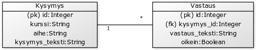

# Tietokantojen perusteet (Toinen harjoitustyö)

## Kysymyspankki

Työn aiheena on kysymyspankki, jossa on kysymyksiä ja niihin liittyviä vastauksia.

Sovelluksen tarjoamat toiminnallisuudet ovat:
1. Kysymysten lisääminen palveluun.
2. Vastausten lisääminen palveluun.
3. Kysymysten listaus.
4. Kysymysten katsoaminen. Kysymystä näyttävästä sivusta näkee myös siihen liittyvät vastaukset.

### Luokkakaavio

## Projektin linkit
* [Github repositio](https://github.com/Jasminmo/tikape-runko)
* [Heroku webpalvelu](http://limitless-chamber-82225.herokuapp.com)
